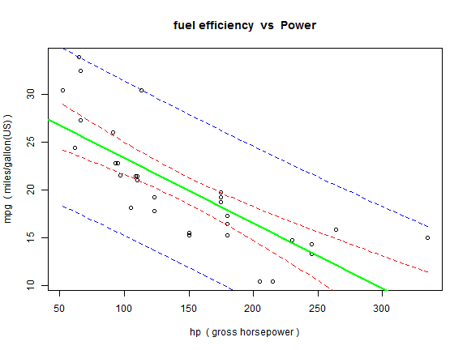

## Now we have graphic insights into mtcars

 ShinyCars, a Shiny Application, lets you understand graphically how each variable in the dataset relates to any other variable 

  * with scatter  plots
  
  * modelled with linear "least squares"  datafit
  
  * showing confidence intervals  for the model fit
  
  * showing confidence intervals  for the model point prediction

---

## Intuitive insight, unlike the dataset!

for example it shows you a figure like this (the code is in the .Rmd file, not here on Rpubs! trust me!!!):

---

## Slide 5 Better yet lets go to the app and see what it can do:

 
 
 

Click here, http://robmitch9999.shinyapps.io/ShinyCars/
 
 
 
<a href="http://robmitch9999.shinyapps.io/ShinyCars/">or here!!!</a>

